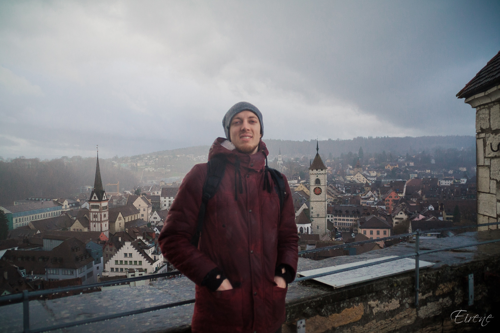

## Shcherbak Aleksei | .NET Developer

Creative .NET Developer with 4 years of commercial experience in backend (C#, .NET, WebApi, MVC) and frontend (vue, React, jQuery), 
GOF Design Patterns & OOP areas with willingness to learn new technologies.

[>> PDF version <<](./README.pdf)

## CONTACTS
* **Phone**: +7-911-911-4396
* **Email**: aleksej.shherbak@yandex.ru
* LinkedIn: https://www.linkedin.com/in/aleksej-shherbak-538914165/

## KEY SKILLS

### **Back End**:
* .NET: C#, MVC, WebApi
* PHP (as an additional language)

### **Front End**:
* Vue, React, CSS, HTML
* JavaScript, ES6
* jQuery, Bootstrap, MUI

### **Databases and storages**: 
* Postgres
* Redis
* ArangoDb (familiar)

### **Testing**:
* NUnit

### **DevOps**:
* Familiar with Azure devops, Bitbacket Pipelines

### **Additional instruments and skils**:
* Git, Rest, Docker / docker-compose, GoF Design Patterns, OOP

## WORK HISTORY

### **Waveaccess, Fullstack Developer,  April 2022 - till now** 
https://www.wave-access.com/

### **Quantum Art, Backend Developer, September 2020 - April 2022** 
 https://quantumart.ru 

* Assessing, gathering and validation project requirements using Agile & Scrum principles related to the critical parts of a big telecom operator's website resulting in estimation of Level of effort and required working hours.
* Developing new and customization of the existing features (backend 80%, frontend 20%) for the high-volume telecom operator website.
* Documenting implemented features.

### **PushApp, Backend Developer, Fullstack Developer, August 2018 — June 2020** 

* Maintaining newly developed and legacy systems critical internal web application.
* Designing new databases and data schemas for the business-critical online service improving data integrity and execution efficiency.
* Creating new web applications from scratch.
* Full Stack development of the high-volume analytical-facing web application applying knowledge of Vue/Vuex and .NET.
* Performance tunning of the legacy web applications.
* Mentoring and couching newly hired team members.

### **Chinese Tour Operator Qiankun, Laravel Developer, June 2018 — August 2018** 
* Creating internal business management system from scratch.

### **Blackidea, Fullstack Developer, December 2017 — June 2018** 
* Full Stack development of the high-volume eCommerce website.

### **Miiix (smart eShop catalog), Backend Developer, December 2016 — December 2017**
* Parsing and scraping web pages. 

### **Binardy web studio, Fullstack Developer, June 2015 — December 2016**
* Creating and supporting internet shops using PHP.

### **Seventest, Backend Developer (intern), Backend Developer, February 2015 — June 2015** 
http://seventest.ru/ 

* Support legacy web-application. 

## PROJECTS
* https://payforinstall.ru (maintains critical features using Codeigniter)
* https://new.rodovoederevo.ru/ (implementing different backend features and background tasks using .NET Core 3.1 and C#)
* https://mts.ru (Maintaining legacy parts of the website, creating new features according to business demands)
* https://skylink.ru (Support and customization of the existing features)

## EDUCATION
* St. Petersburg State University of Telecommunications named after Prof. M.A. Bonch-Bruevich, 2018

## MY STRENGTHS
I do not shift my job to someone else. If I have a problem, and I can't solve it, and it's clear that
my colleagues is unlikely to answer me right away, I'd better go to Stackoverflow and ask.
In addition to programming, I like music, play guitar in a band. I try to develop
comprehensively and not be a "troglodyte", shielded from the whole world by a wall of monitors.

## ADDITIONAL INFORMATION
* English language: B2
* Ready to relocation
